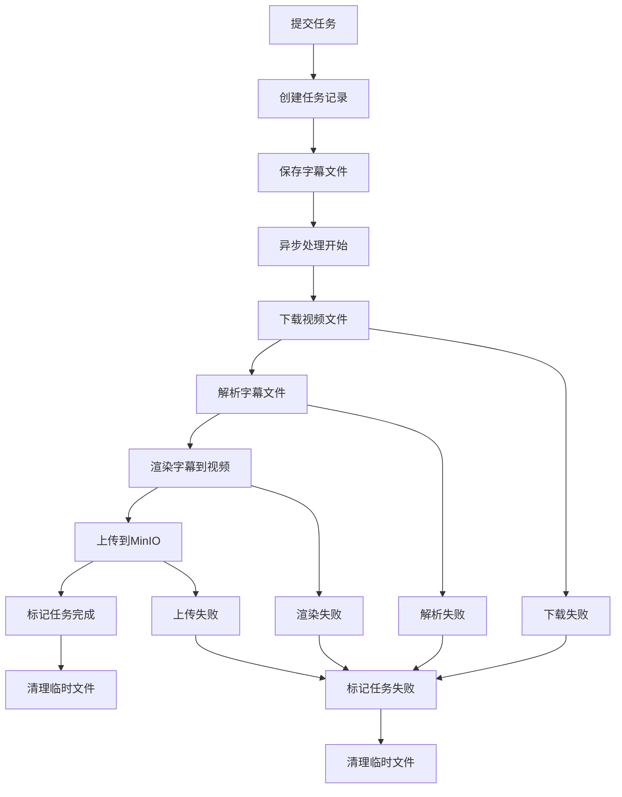

# SubtitleFusion 异步API接口文档

## 概述

异步字幕渲染API提供了完整的异步处理方案，解决了同步处理耗时长、容易超时的问题。支持自定义任务ID，实时状态查询，适合处理大视频文件的字幕渲染任务。

## 核心优势

- ✅ **立即响应**: 提交任务后立即返回，无需等待处理完成
- ✅ **自定义任务ID**: 支持用户自定义任务标识符
- ✅ **状态跟踪**: 实时查询处理进度和状态
- ✅ **并发处理**: 支持多任务并行处理
- ✅ **资源管理**: 自动清理临时文件和过期任务
- ✅ **错误处理**: 详细的错误信息和状态反馈

## API接口列表

### 1. 提交异步任务

**接口路径**: `POST /api/subtitles/burn-url-srt/async`

#### 请求参数
| 参数名 | 类型 | 必填 | 说明 |
|--------|------|------|------|
| `taskId` | String | 是 | 自定义任务ID，全局唯一 |
| `videoUrl` | String | 是 | 视频文件URL，支持HTTP/HTTPS |
| `subtitleFile` | MultipartFile | 是 | SRT格式字幕文件 |

#### 成功响应
```json
{
  "taskId": "my_custom_task_20241201_001",
  "state": "PENDING",
  "message": "任务已创建，等待处理",
  "outputUrl": null,
  "errorMessage": null,
  "createTime": "2024-12-01T10:30:00",
  "updateTime": "2024-12-01T10:30:00",
  "progress": 0
}
```

#### 错误响应
```json
{
  "taskId": "my_custom_task_20241201_001",
  "state": null,
  "message": "任务ID已存在，请使用不同的taskId",
  "outputUrl": null,
  "errorMessage": null,
  "createTime": null,
  "updateTime": null,
  "progress": 0
}
```

---

### 2. 查询任务状态

**接口路径**: `GET /api/subtitles/task/{taskId}`

#### 路径参数
| 参数名 | 类型 | 必填 | 说明 |
|--------|------|------|------|
| `taskId` | String | 是 | 任务ID |

#### 响应示例

**处理中任务**:
```json
{
  "taskId": "my_custom_task_20241201_001",
  "state": "PROCESSING",
  "message": "正在逐帧渲染字幕",
  "outputUrl": null,
  "errorMessage": null,
  "createTime": "2024-12-01T10:30:00",
  "updateTime": "2024-12-01T10:32:15",
  "progress": 50
}
```

**完成任务**:
```json
{
  "taskId": "my_custom_task_20241201_001",
  "state": "COMPLETED",
  "message": "处理完成",
  "outputUrl": "https://minio.example.com/videos/processed_video_20241201_103245.mp4",
  "errorMessage": null,
  "createTime": "2024-12-01T10:30:00",
  "updateTime": "2024-12-01T10:35:20",
  "progress": 100
}
```

**失败任务**:
```json
{
  "taskId": "my_custom_task_20241201_001",
  "state": "FAILED",
  "message": "处理失败: 无法下载视频文件",
  "outputUrl": null,
  "errorMessage": "无法下载视频文件",
  "createTime": "2024-12-01T10:30:00",
  "updateTime": "2024-12-01T10:31:10",
  "progress": 10
}
```

---

### 3. 获取任务总数

**接口路径**: `GET /api/subtitles/tasks/count`

#### 响应示例
```json
{
  "taskCount": 5
}
```

## 任务状态说明

| 状态 | 说明 | 进度范围 |
|------|------|----------|
| `PENDING` | 等待处理 | 0% |
| `DOWNLOADING` | 下载视频中 | 10-25% |
| `PROCESSING` | 字幕渲染中 | 30-80% |
| `UPLOADING` | 上传到MinIO中 | 85-95% |
| `COMPLETED` | 处理完成 | 100% |
| `FAILED` | 处理失败 | 任意% |

## 处理流程详解



## 使用示例

### cURL 示例

#### 1. 提交任务
```bash
curl -X POST http://localhost:8081/api/subtitles/burn-url-srt/async \
  -F "taskId=my_video_task_001" \
  -F "videoUrl=https://example.com/video.mp4" \
  -F "subtitleFile=@subtitle.srt"
```

#### 2. 查询状态
```bash
curl -X GET http://localhost:8081/api/subtitles/task/my_video_task_001
```

### JavaScript 示例

```javascript
// 提交任务
async function submitTask() {
    const formData = new FormData();
    formData.append('taskId', 'js_task_' + Date.now());
    formData.append('videoUrl', 'https://example.com/video.mp4');
    formData.append('subtitleFile', fileInput.files[0]);

    const response = await fetch('/api/subtitles/burn-url-srt/async', {
        method: 'POST',
        body: formData
    });
    
    const result = await response.json();
    console.log('任务已提交:', result);
    return result.taskId;
}

// 轮询查询状态
async function pollTaskStatus(taskId) {
    const response = await fetch(`/api/subtitles/task/${taskId}`);
    const status = await response.json();
    
    console.log(`任务状态: ${status.state}, 进度: ${status.progress}%`);
    
    if (status.state === 'COMPLETED') {
        console.log('处理完成，下载链接:', status.outputUrl);
        return status;
    } else if (status.state === 'FAILED') {
        console.error('处理失败:', status.errorMessage);
        return status;
    } else {
        // 继续轮询
        setTimeout(() => pollTaskStatus(taskId), 5000);
    }
}

// 使用示例
async function processVideo() {
    const taskId = await submitTask();
    if (taskId) {
        pollTaskStatus(taskId);
    }
}
```

## 最佳实践

### 1. 任务ID命名建议
- 使用有意义的前缀：`user123_video_20241201_001`
- 包含时间戳避免冲突：`task_${Date.now()}`
- 限制长度：建议50字符以内

### 2. 状态查询策略
- **初始阶段**（下载）：每5秒查询一次
- **处理阶段**（渲染）：每10秒查询一次
- **完成后**：停止查询，显示结果

### 3. 错误处理
```javascript
// 检查任务是否失败
if (status.state === 'FAILED') {
    switch(status.errorMessage) {
        case '无法下载视频文件':
            alert('视频URL无效或无法访问');
            break;
        case 'Java2D方案仅支持 .srt 字幕格式':
            alert('请上传SRT格式的字幕文件');
            break;
        default:
            alert('处理失败: ' + status.errorMessage);
    }
}
```

### 4. 资源管理
- 定期调用 `/tasks/count` 监控系统负载
- 避免在短时间内提交大量任务
- 任务完成后，服务器会自动清理24小时前的记录

## 系统配置

### 线程池配置
- **核心线程数**: 2（同时处理的基础任务数）
- **最大线程数**: 4（峰值处理能力）
- **队列容量**: 100（等待队列大小）
- **拒绝策略**: 由调用者执行

### 超时设置
- **连接超时**: 30秒
- **读取超时**: 60秒
- **任务关闭等待**: 300秒

## 性能指标

| 视频规格 | 预估处理时间 | 建议轮询间隔 |
|---------|-------------|-------------|
| 1分钟 720p | 2-5分钟 | 5秒 |
| 5分钟 1080p | 8-15分钟 | 10秒 |
| 10分钟 1080p | 15-30分钟 | 15秒 |

## 常见问题

### Q: 如何处理任务ID冲突？
A: 系统会检查任务ID唯一性，如果冲突会返回错误。建议使用时间戳或UUID确保唯一性。

### Q: 任务提交后多久开始处理？
A: 通常在几秒内开始处理，具体取决于当前队列中的任务数量。

### Q: 处理失败的任务如何重试？
A: 需要使用新的任务ID重新提交，系统不提供自动重试功能。

### Q: 任务记录保存多久？
A: 完成或失败的任务记录保存24小时后自动清理。

---

*文档更新时间: 2024年12月*
