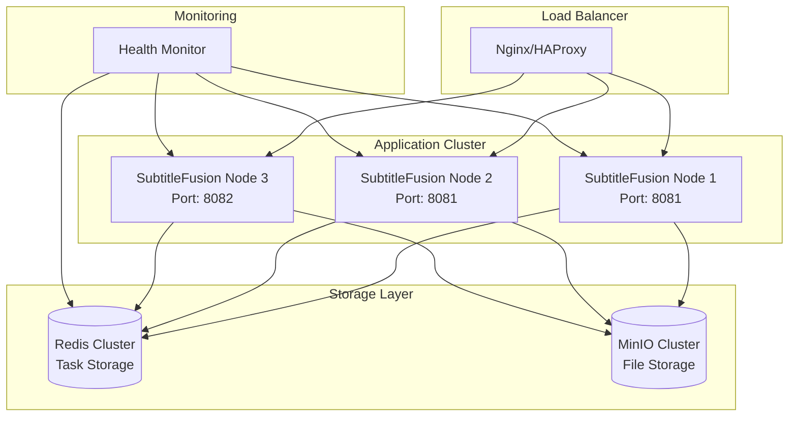

# SubtitleFusion 分布式集群部署指南

## 概述

为了支持分布式集群部署，SubtitleFusion 进行了全面的架构优化，解决了单机部署的局限性，实现了真正的分布式高可用架构。

## 🏗️ **架构优化亮点**

### 1. **分布式任务存储**
- ✅ **Redis集中存储**: 替代内存存储，实现跨节点任务状态共享
- ✅ **分布式锁**: 使用Redisson防止任务重复处理
- ✅ **节点标识**: 每个节点有唯一ID，支持任务归属跟踪

### 2. **故障容错机制**
- ✅ **僵尸任务恢复**: 自动检测和恢复异常停止的任务
- ✅ **节点故障转移**: 节点宕机后任务自动重新调度
- ✅ **健康检查**: 实时监控节点和Redis连接状态

### 3. **智能任务调度**
- ✅ **负载均衡**: 任务在集群节点间智能分配
- ✅ **资源隔离**: 每个节点独立处理资源管理
- ✅ **定时清理**: 自动清理过期任务和僵尸任务

## 🚀 **部署架构**



## 📋 **部署准备**

### 1. **环境要求**
- Java 8+
- Redis 6.0+
- MinIO集群
- 负载均衡器 (Nginx/HAProxy)

### 2. **Redis集群配置**
```bash
# Redis主从配置示例
# Master节点
redis-server --port 6379 --bind 0.0.0.0

# Slave节点  
redis-server --port 6379 --bind 0.0.0.0 --slaveof master-ip 6379
```

### 3. **MinIO集群配置**
```bash
# MinIO分布式部署
minio server http://node{1...4}/data/minio --console-address ":9001"
```

## ⚙️ **应用配置**

### 1. **Redis配置** (application.properties)
```properties
# Redis配置 - 分布式任务存储
spring.data.redis.host=redis-cluster-endpoint
spring.data.redis.port=6379
spring.data.redis.database=0
spring.data.redis.timeout=5000ms
spring.data.redis.password=your-redis-password

# 启用Redis存储模式
task.storage.type=redis

# 任务管理配置
task.cleanup.interval=3600000
task.retry.max-attempts=3
task.lock.timeout=300000
```

### 2. **MinIO配置**
```properties
# MinIO配置
minio.endpoint=http://minio-cluster:9000
minio.ext-endpoint=https://your-domain.com
minio.bucket-name=subtitle-videos
minio.access-key=your-access-key
minio.secret-key=your-secret-key
```

### 3. **应用端口配置**
```properties
# 节点1
server.port=8081

# 节点2  
server.port=8081

# 节点3
server.port=8082
```

## 🔧 **核心组件说明**

### 1. **DistributedTaskStorageService**
```java
// 分布式任务存储服务
- Redis集中存储任务状态
- 分布式锁防止冲突
- 节点任务归属管理
- 僵尸任务检测和恢复
```

### 2. **TaskSchedulerService**
```java
// 任务调度服务
- 每30分钟检测僵尸任务
- 每1小时清理过期任务  
- 每5分钟报告节点状态
```

### 3. **HealthCheckService**
```java
// 健康检查服务
- Redis连接状态监控
- 节点任务统计
- 健康状态报告
```

## 🚀 **部署步骤**

### 1. **部署Redis集群**
```bash
# 启动Redis主节点
docker run -d --name redis-master \
  -p 6379:6379 \
  redis:6.2 redis-server --appendonly yes

# 启动Redis从节点
docker run -d --name redis-slave \
  -p 6380:6379 \
  redis:6.2 redis-server --appendonly yes --slaveof redis-master-ip 6379
```

### 2. **部署MinIO集群**
```bash
# MinIO集群启动
docker run -d --name minio-node1 \
  -p 9000:9000 -p 9001:9001 \
  -v /data/minio:/data \
  minio/minio server http://node{1...4}/data --console-address ":9001"
```

### 3. **部署应用节点**
```bash
# 节点1
java -jar -Dserver.port=8081 subtitle-fusion.jar

# 节点2
java -jar -Dserver.port=8081 subtitle-fusion.jar

# 节点3
java -jar -Dserver.port=8082 subtitle-fusion.jar
```

### 4. **配置负载均衡**
```nginx
# Nginx配置
upstream subtitle_backend {
    server node1:8081 weight=1;
    server node2:8081 weight=1;  
    server node3:8082 weight=1;
}

server {
    listen 80;
    location /api/subtitles/ {
        proxy_pass http://subtitle_backend;
        proxy_set_header Host $host;
        proxy_set_header X-Real-IP $remote_addr;
    }
}
```

## 📊 **监控和管理**

### 1. **健康检查接口**
```bash
# 检查节点健康状态
GET /api/subtitles/health/node

# 响应示例
{
  "nodeId": "hostname-12345",
  "globalTaskCount": 15,
  "nodeTaskCount": 5,
  "status": "healthy",
  "redis.status": "connected",
  "timestamp": 1640995200000
}
```

### 2. **任务监控**
```bash
# 获取任务总数
GET /api/subtitles/tasks/count

# 查看特定任务状态  
GET /api/subtitles/task/{taskId}
```

### 3. **日志监控**
```bash
# 关键日志模式
2024-12-01 10:30:00 - 节点 hostname-12345 创建新任务: task_001
2024-12-01 10:30:05 - 任务 task_001 状态更新为: 下载视频中
2024-12-01 10:35:00 - 节点状态报告 - 节点ID: hostname-12345, 本节点任务数: 3, 全局任务数: 8
2024-12-01 11:00:00 - 开始僵尸任务恢复检查...
2024-12-01 12:00:00 - 清理了 5 个过期任务
```

## 🔍 **故障处理**

### 1. **节点故障**
- 任务自动转移到其他健康节点
- 僵尸任务恢复机制自动处理未完成任务
- 负载均衡器自动摘除故障节点

### 2. **Redis故障**
- 应用自动降级到内存存储模式
- 主从切换保证服务连续性
- 集群恢复后自动重新连接

### 3. **MinIO故障**
- 分布式存储保证数据可用性
- 自动重试上传机制
- 备用存储策略

## 📈 **性能优化**

### 1. **线程池配置**
```properties
# 根据节点资源调整线程池
subtitleTaskExecutor.corePoolSize=4
subtitleTaskExecutor.maxPoolSize=8
subtitleTaskExecutor.queueCapacity=200
```

### 2. **Redis连接池优化**
```properties
spring.data.redis.lettuce.pool.max-active=16
spring.data.redis.lettuce.pool.max-idle=8
spring.data.redis.lettuce.pool.min-idle=2
```

### 3. **任务分配策略**
- 智能负载均衡避免热点节点
- 任务优先级机制
- 资源预留和限流

## 🏆 **最佳实践**

### 1. **容量规划**
- 每个节点建议2-4个并发任务
- Redis内存按任务数量 × 10KB预估
- MinIO存储按视频大小 × 3倍预估

### 2. **高可用部署**
- 至少3个应用节点
- Redis主从 + 哨兵模式
- MinIO至少4节点分布式部署

### 3. **安全配置**
- Redis密码认证
- MinIO访问密钥轮换
- 网络安全组限制

### 4. **监控告警**
- 节点健康状态监控
- 任务堆积告警
- 资源使用率监控

## 🔄 **版本升级**

### 1. **滚动升级**
```bash
# 逐个节点升级，保证服务不中断
1. 停止节点1 -> 升级 -> 启动 -> 健康检查
2. 停止节点2 -> 升级 -> 启动 -> 健康检查  
3. 停止节点3 -> 升级 -> 启动 -> 健康检查
```

### 2. **数据迁移**
- Redis数据自动兼容
- 任务状态平滑过渡
- 配置文件向后兼容

---

通过以上分布式优化，SubtitleFusion 现在完全支持大规模集群部署，具备企业级的高可用、高性能和高扩展性！
